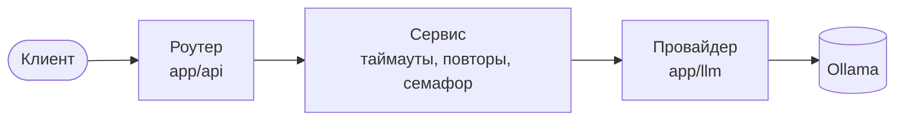

# llm-chat-api

Асинхронный бэкенд для работы с LLM, построенный как production-проект, а не демо-эндпоинт.
Сервис принимает запросы к чату, валидирует их, вызывает LLM-провайдера с таймаутами и
повторами, сохраняет диалоги и расход токенов, считает стоимость, стримит ответы и отдаёт
метрики.

Проект учебный: цель — освоить навыки Middle AI / LLM Engineer и уметь объяснить каждое
архитектурное решение.

## Текущее состояние

**Неделя 2 из 6 завершена** — реальная LLM и надёжность асинхронных вызовов.

Что уже работает:

- HTTP API на FastAPI со строгой валидацией запросов через Pydantic v2
- Ответы реальной модели через локальную Ollama (OpenAI-совместимый API)
- Абстракция провайдера: сервис не зависит от SDK конкретного вендора
- Асинхронные вызовы модели, не блокирующие event loop
- Таймаут на вызов модели и понятный ответ `504` вместо зависания
- Ограниченные повторы только для временных сбоев с exponential backoff и jitter
- Ограничение числа одновременных вызовов модели
- Общий HTTP-клиент на весь процесс через lifespan приложения
- 51 тест, включая все пути отказов; mypy в строгом режиме

Чего пока нет: базы данных, учёта стоимости, structured output, кэша, стриминга, авторизации.
Всё это — следующие недели роадмапа.

## API

| Метод | Путь | Назначение |
|---|---|---|
| `GET` | `/` | Идентификация сервиса и версия |
| `GET` | `/health` | Проверка живости процесса |
| `POST` | `/v1/chat` | Запрос к модели |

Пример запроса:

```bash
curl.exe -X POST http://127.0.0.1:8000/v1/chat -H "Content-Type: application/json" -d "{\"model\": \"qwen3:8b\", \"messages\": [{\"role\": \"user\", \"content\": \"Столица Франции?\"}], \"params\": {\"temperature\": 0, \"max_tokens\": 50}}"
```

Ответ:

```json
{
  "model": "qwen3:8b",
  "message": {"role": "assistant", "content": "Париж"},
  "usage": {"input_tokens": 30, "output_tokens": 4}
}
```

| Код | Когда |
|---|---|
| `200` | модель ответила |
| `422` | запрос не прошёл валидацию; адрес ошибки в поле `loc` |
| `502` | провайдер вернул ошибку или недоступен, повторы исчерпаны |
| `504` | модель не ответила за отведённое время |

Полная схема — в Swagger UI по адресу `/docs` после запуска.

## Архитектура



- **Роутер** отвечает только за HTTP.
- **Сервис** управляет надёжностью вызова и не знает ни про HTTP, ни про SDK вендора.
- **Провайдер** вызывает конкретную модель и переводит её ошибки в собственные исключения.

Подробно — в [docs/architecture.md](docs/architecture.md). Замеры асинхронности, семафора и
переиспользования клиента — в [docs/async-experiments.md](docs/async-experiments.md).

## Стек

Python 3.12, FastAPI, Pydantic v2, pydantic-settings, OpenAI Python SDK, Ollama, Uvicorn,
pytest, Ruff, mypy.

По мере продвижения появятся: PostgreSQL + SQLAlchemy + Alembic, Redis, Docker Compose,
Prometheus, OpenTelemetry, GitHub Actions.

## Запуск

Требуется Python 3.12+ и [Ollama](https://ollama.com) с загруженной моделью:

```bash
ollama pull qwen3:8b
```

Установка:

```bash
git clone https://github.com/DelixeamI/llm-chat-api.git
cd llm-chat-api
python -m venv .venv
.venv\Scripts\activate
pip install -e ".[dev]"
```

Скопируйте `.env.example` в `.env` и при необходимости измените значения. Файл `.env` не
коммитится.

| Переменная | По умолчанию | Назначение |
|---|---|---|
| `OLLAMA_BASE_URL` | `http://127.0.0.1:11434/v1` | адрес OpenAI-совместимого API Ollama |
| `OLLAMA_REASONING_EFFORT` | `none` | отключает долгие рассуждения reasoning-моделей |
| `LLM_TIMEOUT_SECONDS` | `60` | предел на одну попытку вызова модели |
| `LLM_MAX_RETRIES` | `2` | число повторов при временных сбоях |
| `LLM_RETRY_BASE_DELAY_SECONDS` | `0.5` | база экспоненциальной паузы |
| `LLM_RETRY_MAX_DELAY_SECONDS` | `8` | потолок паузы между повторами |
| `LLM_MAX_CONCURRENCY` | `5` | максимум одновременных вызовов модели |

Запуск сервера:

```bash
uvicorn app.main:app --reload
```

Документация API: http://127.0.0.1:8000/docs

## Проверки

```bash
pytest -v          # тесты, Ollama не нужна
mypy app tests     # типы, строгий режим
ruff check .       # линтер
ruff format .      # форматирование
```

## Структура проекта

```
app/
├── main.py              lifespan, обработчики ошибок, сборка приложения
├── config.py            настройки из окружения
├── api/                 HTTP-слой и получение сервиса
├── services/            таймауты, повторы, ограничение конкурентности
├── llm/                 протокол провайдера и реализация для Ollama
└── schemas/             контракты данных (Pydantic)
tests/
├── fakes.py             фейковые провайдеры
├── test_chat.py         контракт чата и коды ошибок через HTTP
├── test_chat_service.py пути отказов сервиса
├── test_ollama_provider.py  перевод ошибок провайдера
└── ...
scripts/                 воспроизводимые эксперименты с реальной моделью
docs/
├── architecture.md      архитектура и принятые решения
└── async-experiments.md замеры и выводы
```

## Роадмап

| Неделя | Тема | Статус |
|---|---|---|
| 1 | FastAPI, Pydantic, слоистая архитектура | ✅ |
| 2 | Интеграция LLM и asyncio: таймауты, повторы, ограничение конкурентности | ✅ |
| 3 | PostgreSQL, миграции, транзакции | ⏳ |
| 4 | Structured output, учёт токенов и стоимости, контекстное окно | |
| 5 | Redis, стриминг, авторизация, rate limiting, идемпотентность | |
| 6 | Логи, метрики, трейсинг, Docker, CI/CD, релиз v1.0 | |
