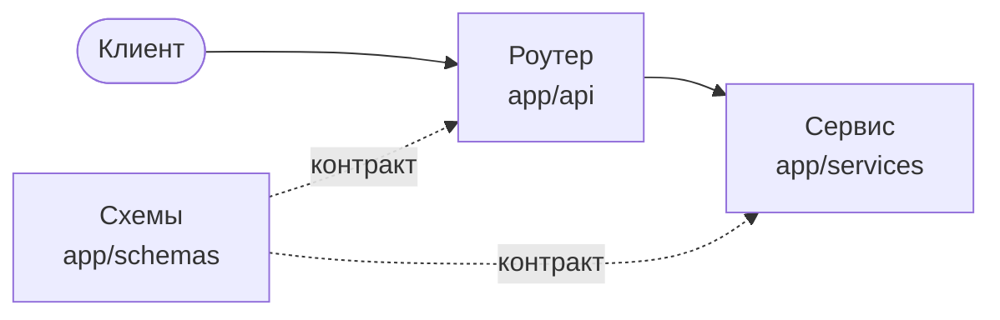

# llm-chat-api

Асинхронный бэкенд для работы с LLM, построенный как production-проект, а не демо-эндпоинт.
Сервис принимает запросы к чату, валидирует их, вызывает LLM-провайдера с таймаутами и
повторами, сохраняет диалоги и расход токенов, считает стоимость, стримит ответы и отдаёт
метрики.

Проект учебный: цель — освоить навыки Middle AI / LLM Engineer и уметь объяснить каждое
архитектурное решение.

## Текущее состояние

**Неделя 1 из 6 завершена** — фундамент на FastAPI и Pydantic.

Что уже работает:

- HTTP API на FastAPI с автоматической документацией OpenAPI
- Строгая валидация входящих запросов: типы, границы значений, запрет неизвестных полей,
  бизнес-правила
- Разделение на слои: роутер → сервис → схемы
- 20 тестов: контракт API и модели данных

Чего пока нет: реального вызова LLM (сервис возвращает заглушку), базы данных, кэша,
стриминга, авторизации. Всё это — следующие недели роадмапа.

## API

| Метод | Путь | Назначение |
|---|---|---|
| `GET` | `/` | Идентификация сервиса и версия |
| `GET` | `/health` | Проверка живости процесса |
| `POST` | `/v1/chat` | Запрос к чату |

Пример запроса:

```bash
curl.exe -X POST http://127.0.0.1:8000/v1/chat -H "Content-Type: application/json" -d "{\"model\": \"llama3\", \"messages\": [{\"role\": \"user\", \"content\": \"Привет\"}]}"
```

Ответ:

```json
{
  "model": "llama3",
  "message": {"role": "assistant", "content": "..."},
  "usage": {"input_tokens": 0, "output_tokens": 0}
}
```

Некорректный запрос возвращает `422` с точным адресом ошибки в поле `loc`. Полная схема —
в Swagger UI по адресу `/docs` после запуска.

## Архитектура



- **Схемы** описывают контракт данных и валидируют его.
- **Роутер** отвечает только за HTTP: путь, метод, коды ответов.
- **Сервис** содержит логику приложения и ничего не знает про HTTP.

Подробно — в [docs/architecture.md](docs/architecture.md).

## Стек

Python 3.12, FastAPI, Pydantic v2, Uvicorn, pytest, Ruff.

По мере продвижения появятся: PostgreSQL + SQLAlchemy + Alembic, Redis, Docker Compose,
Prometheus, OpenTelemetry, GitHub Actions.

## Запуск

Требуется Python 3.12+.

```bash
git clone https://github.com/DelixeamI/llm-chat-api.git
cd llm-chat-api
python -m venv .venv
.venv\Scripts\activate
pip install -e ".[dev]"
```

Скопируйте `.env.example` в `.env` и заполните значения. Файл `.env` не коммитится.

Запуск сервера:

```bash
uvicorn app.main:app --reload
```

Документация API: http://127.0.0.1:8000/docs

## Проверки

```bash
pytest -v          # тесты
ruff check .       # линтер
ruff format .      # форматирование
```

## Структура проекта

```
app/
├── main.py          сборка приложения и подключение роутеров
├── api/             HTTP-слой
├── services/        логика приложения
└── schemas/         контракты данных (Pydantic)
tests/
├── conftest.py      общие фикстуры
├── test_health.py   маршрутизация
├── test_chat.py     контракт чата через HTTP
└── test_schemas.py  модели данных напрямую
docs/
└── architecture.md  архитектура и принятые решения
```

## Роадмап

| Неделя | Тема | Статус |
|---|---|---|
| 1 | FastAPI, Pydantic, слоистая архитектура | ✅ |
| 2 | Интеграция LLM и asyncio: таймауты, повторы, ограничение конкурентности | ⏳ |
| 3 | PostgreSQL, миграции, транзакции | |
| 4 | Structured output, учёт токенов и стоимости, контекстное окно | |
| 5 | Redis, стриминг, авторизация, rate limiting, идемпотентность | |
| 6 | Логи, метрики, трейсинг, Docker, CI/CD, релиз v1.0 | |
