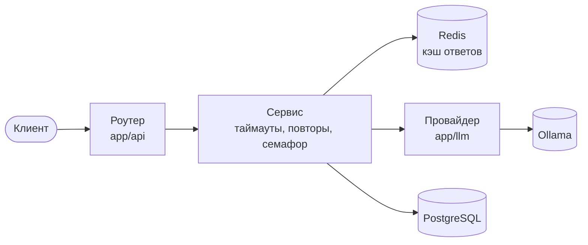

# llm-chat-api

Асинхронный бэкенд для работы с LLM, построенный как production-проект, а не демо-эндпоинт.
Сервис принимает запросы к чату, валидирует их, вызывает LLM-провайдера с таймаутами и
повторами, сохраняет диалоги и расход токенов, считает стоимость, стримит ответы и отдаёт
метрики.

Проект учебный: цель — освоить навыки Middle AI / LLM Engineer и уметь объяснить каждое
архитектурное решение.

## Текущее состояние

**Неделя 5 из 6 в работе** — Redis и кэш детерминированных ответов готовы (дни 29–30).

Что уже работает:

- HTTP API на FastAPI со строгой валидацией запросов через Pydantic v2
- Ответы реальной модели через локальную Ollama (OpenAI-совместимый API)
- Абстракция провайдера: сервис не зависит от SDK конкретного вендора
- Асинхронные вызовы модели, не блокирующие event loop
- Таймаут на вызов модели и понятный ответ `504` вместо зависания
- Ограниченные повторы только для временных сбоев с exponential backoff и jitter
- Ограничение числа одновременных вызовов модели
- Общий HTTP-клиент на весь процесс через lifespan приложения
- Диалоги и сообщения сохраняются в PostgreSQL, расход токенов пишется вместе с ответом
- Схема базы управляется миграциями Alembic
- Запись обмена репликами атомарна: диалог и оба сообщения появляются вместе или никак
- Structured output: ответ модели по JSON Schema из модели Pydantic, валидация и ограниченное
  восстановление при невалидном выводе
- Журнал расхода токенов по каждому оплачиваемому вызову, включая неудачные
- Стоимость запросов в USD и RUB, отчёты и прогноз расходов на месяц
- Проверка контекстного окна до вызова модели: отказ или обрезание старых ходов
- Redis с общим пулом соединений; кэш ответов на запросы с `temperature: 0`, счётчики попаданий
  и промахов, работа без кэша при недоступном Redis
- 142 теста, включая интеграционные против настоящих PostgreSQL и Redis; mypy в строгом режиме

Чего пока нет: стриминга, авторизации, ограничения частоты запросов, метрик.
Всё это — следующие недели роадмапа.

## API

| Метод | Путь | Назначение |
|---|---|---|
| `GET` | `/` | Идентификация сервиса и версия |
| `GET` | `/health` | Проверка живости процесса |
| `POST` | `/v1/chat` | Запрос к модели |
| `POST` | `/v1/chat/structured` | Классификация обращения: ответ строго по схеме |
| `POST` | `/v1/conversations` | Создать диалог |
| `GET` | `/v1/conversations/{id}` | Прочитать диалог |
| `GET` | `/v1/conversations/{id}/messages` | История сообщений диалога |
| `GET` | `/v1/usage` | Расход токенов по моделям за окно в днях |
| `GET` | `/v1/usage/cost` | Стоимость в USD и RUB, прогноз на месяц |
| `GET` | `/v1/cache/stats` | Попадания и промахи кэша ответов |

Пример запроса:

```bash
curl.exe -X POST http://127.0.0.1:8000/v1/chat -H "Content-Type: application/json" -d "{\"model\": \"qwen3:8b\", \"messages\": [{\"role\": \"user\", \"content\": \"Столица Франции?\"}], \"params\": {\"temperature\": 0, \"max_tokens\": 50}}"
```

Ответ:

```json
{
  "conversation_id": "9d69db36-965a-427b-ae53-ccd9e7b02cfc",
  "model": "qwen3:8b",
  "message": {"role": "assistant", "content": "Париж"},
  "usage": {"input_tokens": 30, "output_tokens": 4, "total_tokens": 34},
  "dropped_messages": 0,
  "cached": false
}
```

Повтор того же запроса вернёт `"cached": true`: при `temperature: 0` ответ берётся из Redis без
вызова модели. Подробно — [docs/caching.md](docs/caching.md).

| Код | Когда |
|---|---|
| `200` | модель ответила |
| `400` | запрос не помещается в контекстное окно модели |
| `404` | указанный диалог не найден |
| `422` | запрос не прошёл валидацию; адрес ошибки в поле `loc` |
| `502` | провайдер вернул ошибку или недоступен, или ответ модели не прошёл проверку по схеме |
| `503` | Redis недоступен там, где без него нельзя ответить (статистика кэша) |
| `504` | модель не ответила за отведённое время |

Полная схема — в Swagger UI по адресу `/docs` после запуска.

## Архитектура


```mermaid
flowchart LR
    client([Клиент]) --> router[Роутер<br/>app/api]
    router --> service[Сервис<br/>таймауты, повторы, семафор]
    service --> cache[(Redis<br/>кэш ответов)]
    service --> provider[Провайдер<br/>app/llm]
    provider --> ollama[(Ollama)]
    service --> db[(PostgreSQL)]
```

- **Роутер** отвечает только за HTTP.
- **Сервис** управляет надёжностью вызова и не знает ни про HTTP, ни про SDK вендора.
- **Провайдер** вызывает конкретную модель и переводит её ошибки в собственные исключения.

Подробно — в [docs/architecture.md](docs/architecture.md), схема и транзакции — в [docs/database.md](docs/database.md). Замеры асинхронности, семафора и
переиспользования клиента — в [docs/async-experiments.md](docs/async-experiments.md).

## Стек

Python 3.12, FastAPI, Pydantic v2, pydantic-settings, OpenAI Python SDK, Ollama, PostgreSQL 17,
SQLAlchemy 2 (async) + asyncpg, Alembic, Redis 8 + redis-py, Docker Compose, Uvicorn, pytest,
Ruff, mypy.

По мере продвижения появятся: Prometheus, OpenTelemetry, GitHub Actions.

## Запуск

Требуется Python 3.12+, Docker и [Ollama](https://ollama.com) с загруженной моделью:

```bash
ollama pull qwen3:8b
```

Установка:

```bash
git clone https://github.com/DelixeamI/llm-chat-api.git
cd llm-chat-api
python -m venv .venv
.venv\Scripts\activate
pip install -e ".[dev]"
```

Скопируйте `.env.example` в `.env` и при необходимости измените значения. Файл `.env` не
коммитится.

| Переменная | По умолчанию | Назначение |
|---|---|---|
| `OLLAMA_BASE_URL` | `http://127.0.0.1:11434/v1` | адрес OpenAI-совместимого API Ollama |
| `OLLAMA_REASONING_EFFORT` | `none` | отключает долгие рассуждения reasoning-моделей |
| `LLM_TIMEOUT_SECONDS` | `60` | предел на одну попытку вызова модели |
| `LLM_MAX_RETRIES` | `2` | число повторов при временных сбоях |
| `LLM_RETRY_BASE_DELAY_SECONDS` | `0.5` | база экспоненциальной паузы |
| `LLM_RETRY_MAX_DELAY_SECONDS` | `8` | потолок паузы между повторами |
| `LLM_MAX_CONCURRENCY` | `5` | максимум одновременных вызовов модели |
| `DATABASE_URL` | `postgresql+asyncpg://...:5433/llm_chat` | подключение к PostgreSQL |
| `POSTGRES_PORT` | `5433` | порт базы на хосте |
| `STRUCTURED_MAX_RETRIES` | `1` | повторы при непригодном структурированном ответе |
| `MODEL_PRICES` | условные цены `qwen3:8b` | цены за миллион входных и выходных токенов |
| `USD_TO_RUB` | `95` | курс для отчётов в рублях |
| `MODEL_CONTEXT_LIMITS` | `{"qwen3:8b": 4096}` | окно модели, должно совпадать с сервером |
| `CONTEXT_OVERFLOW_STRATEGY` | `reject` | `reject` или `truncate_oldest` |
| `REDIS_URL` | `redis://127.0.0.1:6379/0` | подключение к Redis |
| `REDIS_MAX_CONNECTIONS` | `20` | размер пула соединений с Redis на процесс |
| `REDIS_TIMEOUT_SECONDS` | `0.5` | предел на подключение и команду Redis |
| `RESPONSE_CACHE_ENABLED` | `true` | кэш ответов на запросы с `temperature: 0` |
| `RESPONSE_CACHE_TTL_SECONDS` | `3600` | срок жизни записи кэша |

Поднять PostgreSQL и Redis и применить миграции:

```bash
docker compose up -d
alembic upgrade head
```

Запуск сервера:

```bash
uvicorn app.main:app --reload
```

Документация API: http://127.0.0.1:8000/docs

## Проверки

```bash
pytest -v                    # тесты; без базы интеграционные пропускаются
pytest -m integration        # только тесты против PostgreSQL и Redis
mypy app tests scripts migrations   # типы, строгий режим
ruff check .                 # линтер
ruff format .                # форматирование
```

## Структура проекта

```
app/
├── main.py              lifespan, обработчики ошибок, сборка приложения
├── config.py            настройки из окружения
├── api/                 HTTP-слой и получение сервиса
├── services/            таймауты, повторы, ограничение конкурентности
├── llm/                 протокол провайдера и реализация для Ollama
├── db/                  модели, сессии, репозиторий
├── kv/                  клиент Redis и пространство имён ключей
└── schemas/             контракты данных (Pydantic)
migrations/              миграции Alembic
tests/
├── fakes.py             фейковые провайдеры
├── test_chat.py         контракт чата и коды ошибок через HTTP
├── test_chat_service.py пути отказов сервиса
├── test_ollama_provider.py  перевод ошибок провайдера
├── test_db_integration.py   тесты против настоящей PostgreSQL
└── ...
scripts/                 воспроизводимые эксперименты с реальной моделью
docs/
├── architecture.md      архитектура и принятые решения
├── database.md          схема, транзакции, индексы
├── structured-output.md prompt-only, JSON mode и structured output: замеры
├── usage-and-cost.md    журнал расхода, формула стоимости, прогноз
├── context-window.md    обрезание в Ollama, оценка токенов, стратегии
├── redis.md             роль Redis, TTL, ключи, пул соединений: замеры
├── caching.md           что кэшировать, ключ, TTL, попадания и промахи: замеры
└── async-experiments.md замеры и выводы
```

## Роадмап

| Неделя | Тема | Статус |
|---|---|---|
| 1 | FastAPI, Pydantic, слоистая архитектура | ✅ |
| 2 | Интеграция LLM и asyncio: таймауты, повторы, ограничение конкурентности | ✅ |
| 3 | PostgreSQL, миграции, транзакции | ✅ |
| 4 | Structured output, учёт токенов и стоимости, контекстное окно | ✅ |
| 5 | Redis, стриминг, авторизация, rate limiting, идемпотентность | ⏳ |
| 6 | Логи, метрики, трейсинг, Docker, CI/CD, релиз v1.0 | |
