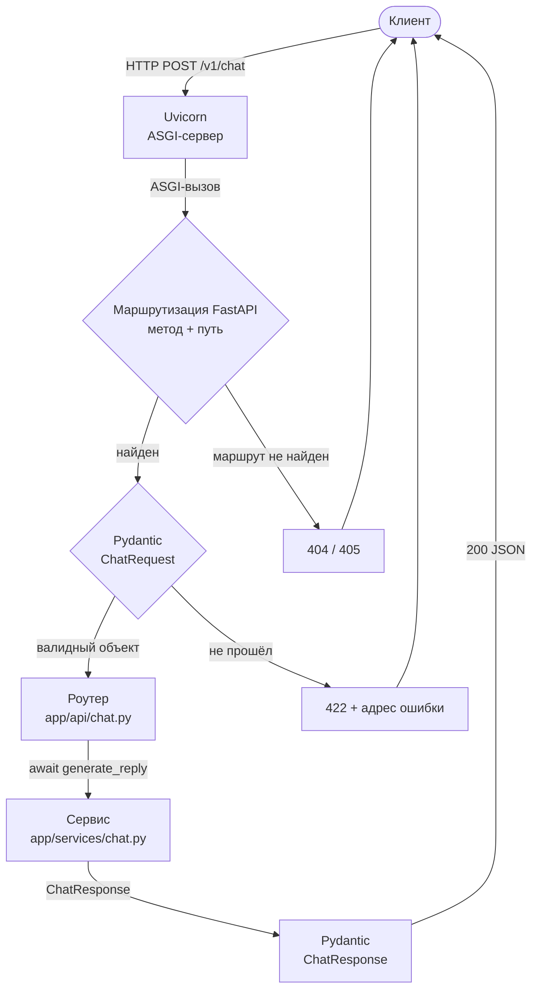
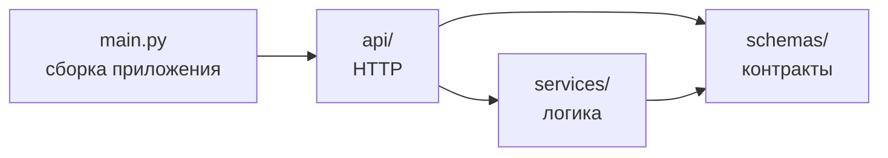

# Архитектура

Документ описывает, как устроено приложение на конец Недели 1: какие есть слои, как через них
проходит запрос и почему решения приняты именно так.

## Путь запроса

1. **Uvicorn** принимает TCP-соединение, разбирает HTTP и вызывает приложение по протоколу ASGI.
2. **FastAPI** ищет маршрут по методу и пути. Путь не найден — `404`, путь есть, но метод
   другой — `405`.
3. **Pydantic** разбирает тело запроса и валидирует его по модели `ChatRequest`. Любая ошибка —
   битый JSON, неверный тип, нарушение границ, неизвестное поле, бизнес-правило — даёт `422`.
4. **Роутер** получает уже проверенный объект и передаёт его сервису.
5. **Сервис** выполняет логику и возвращает `ChatResponse`.
6. **FastAPI** сериализует ответ по модели и отдаёт `200`.

Ключевое свойство: **до кода роутера управление доходит только с валидными данными.** Ни роутер,
ни сервис не проверяют входные данные повторно.

## Слои

Стрелка означает «импортирует». Зависимости направлены в одну сторону: схемы не знают ни о ком,
сервис не знает про HTTP, роутер не содержит логики.

| Слой | Отвечает за | Не должен |
|---|---|---|
| `main.py` | создание приложения, подключение роутеров | содержать эндпоинты с логикой |
| `api/` | путь, HTTP-метод, коды ответов, модель ответа | принимать решения по данным |
| `services/` | логику приложения | импортировать FastAPI, знать про HTTP |
| `schemas/` | контракт данных и его валидацию | зависеть от других слоёв |

## Принятые решения

### Валидация на границе, а не в логике

Вся проверка входных данных описана в моделях Pydantic. Ограничения типов (`ge`, `le`,
`min_length`) проверяют форму данных, валидаторы — смысл:

- `field_validator` на `Message.content` отклоняет строку из одних пробелов и нормализует
  значение, обрезая пробелы по краям;
- `model_validator` на `ChatRequest` требует хотя бы одно сообщение с ролью `user` — правило про
  связь элементов, его нельзя выразить через одно поле.

**Отвергнутая альтернатива:** проверки `if` внутри сервиса. Тогда валидация размазывается по
коду, её легко забыть в новом эндпоинте, а ошибки не попадают в OpenAPI-схему.

### Запрет неизвестных полей

Все модели используют `ConfigDict(extra="forbid")`. Опечатка в имени параметра даёт `422`, а не
молча игнорируется.

**Цена решения:** строгий контракт хуже переносит рассинхрон версий — если клиент обновится
раньше сервера и начнёт слать новое поле, он получит ошибку. Для API с контролируемым набором
клиентов явная ошибка лучше тихого расхождения.

### Тонкий роутер

Эндпоинт — одна строка, делегирующая работу сервису. Сервис не импортирует FastAPI, поэтому его
можно вызвать напрямую из теста, скрипта или фоновой задачи.

**Отвергнутая альтернатива:** логика внутри эндпоинта. Такой код тестируется только через HTTP,
не переиспользуется и превращается в функцию на сотни строк по мере роста проекта.

### Сервис как функция, а не класс

`generate_reply` — модульная функция. Состояния у сервиса пока нет, и класс был бы оболочкой без
содержимого. Класс появится, когда сервису понадобится зависимость — клиент LLM-провайдера.

## Ошибки

| Код | Когда | Кто формирует |
|---|---|---|
| `404` | путь не зарегистрирован | FastAPI |
| `405` | путь есть, метод не поддерживается | FastAPI |
| `422` | тело запроса не прошло валидацию, включая битый JSON | FastAPI + Pydantic |

FastAPI не разделяет синтаксические ошибки JSON и нарушение схемы по коду ответа: оба случая —
`422`. Различие видно в поле `type` каждой ошибки: `json_invalid` против `missing`,
`extra_forbidden` и других.

Схема `ErrorResponse` объявлена для единого формата ошибок приложения, но пока не используется:
первые собственные ошибки появятся вместе с таймаутами вызовов LLM.

## Тесты

| Файл | Уровень | Что проверяет |
|---|---|---|
| `test_schemas.py` | юнит | модели Pydantic напрямую, без HTTP |
| `test_chat.py` | интеграционный | контракт `/v1/chat` через HTTP |
| `test_health.py` | интеграционный | маршрутизацию и коды 404 / 405 |

Тесты используют `TestClient`, который вызывает ASGI-приложение в памяти, без сети и без
запуска сервера. Негативные сценарии проверяют не только код `422`, но и тип ошибки, иначе тест
прошёл бы и при отказе по посторонней причине.

Предупреждения в тестах считаются ошибкой (`filterwarnings = ["error"]`), чтобы устаревшие API
обнаруживались сразу, а не копились.

## Известные ограничения

- Сервис возвращает заглушку вместо ответа модели, расход токенов нулевой.
- Нет персистентности: данные не сохраняются между запросами.
- Нет авторизации и ограничения частоты запросов.
- `Usage.total_tokens` — вычисляемое свойство и не попадает в JSON-ответ.
