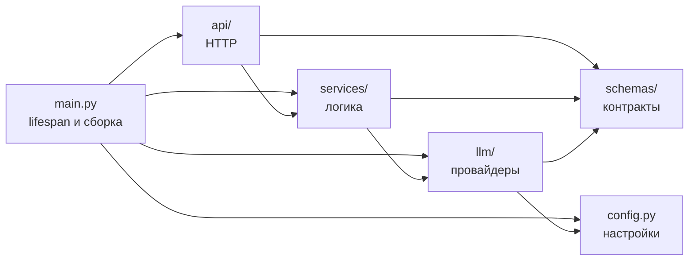
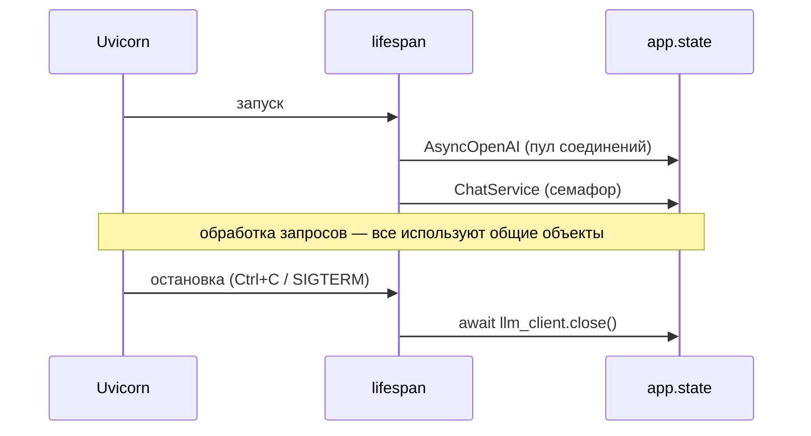

# Архитектура

Документ описывает, как устроено приложение на конец Недели 2: какие есть слои, как через них
проходит запрос к модели, что происходит при отказах и почему решения приняты именно так.

## Путь запроса

```mermaid
flowchart TD
    client([Клиент])
    server[Uvicorn<br/>ASGI-сервер]
    routing{Маршрутизация FastAPI}
    validate{Pydantic<br/>ChatRequest}
    handler[Роутер<br/>app/api/chat.py]
    slot[Семафор<br/>ждём свободный слот]
    call[Вызов провайдера<br/>под asyncio.timeout]
    provider[OllamaProvider<br/>AsyncOpenAI → Ollama]
    decide{Ошибка<br/>повторяемая?<br/>попытки есть?}
    backoff[Пауза<br/>exponential backoff + jitter]
    serialize[Pydantic<br/>ChatResponse]

    e404[404 / 405]
    e422[422]
    e502[502 llm_provider_error]
    e504[504 llm_timeout]

    client -->|HTTP POST /v1/chat| server
    server --> routing
    routing -->|не найден| e404
    routing --> validate
    validate -->|не прошёл| e422
    validate -->|валидный| handler
    handler -->|await generate_reply| slot
    slot --> call
    call --> provider
    provider -->|ответ| serialize
    provider -->|ошибка / таймаут| decide
    decide -->|да| backoff
    backoff --> slot
    decide -->|нет, таймаут| e504
    decide -->|нет, другая ошибка| e502
    serialize -->|200| client
    e404 --> client
    e422 --> client
    e502 --> client
    e504 --> client
```

1. **Uvicorn** принимает соединение и вызывает приложение по ASGI.
2. **FastAPI** ищет маршрут; **Pydantic** валидирует тело. Ошибки — `404`/`405` и `422`.
3. **Роутер** получает сервис через `Depends(get_chat_service)` и передаёт ему валидный запрос.
4. **Сервис** ждёт свободный слот семафора — одновременно выполняется не больше
   `LLM_MAX_CONCURRENCY` вызовов модели.
5. Вызов провайдера ограничен таймаутом `LLM_TIMEOUT_SECONDS`.
6. **Провайдер** отправляет запрос в Ollama через OpenAI-совместимый API и переводит исключения SDK
   в собственные `LLMError`, помечая, повторяемы ли они.
7. При повторяемой ошибке сервис освобождает слот, выжидает случайную паузу и пробует снова — не
   больше `LLM_MAX_RETRIES` раз.
8. Итог: `200` с ответом модели, `504` при исчерпанных таймаутах или `502` при прочих ошибках.

## Слои



Стрелка означает «импортирует».

| Слой | Отвечает за | Не должен |
|---|---|---|
| `main.py` | создание приложения, lifespan, обработчики ошибок | содержать логику запросов |
| `api/` | путь, метод, коды ответов, получение сервиса | принимать решения по данным |
| `services/` | таймауты, повторы, ограничение конкурентности, сборка ответа | импортировать FastAPI или SDK вендора |
| `llm/` | вызов конкретного провайдера и перевод его ошибок | решать, повторять ли вызов |
| `schemas/` | контракт данных и его валидацию | зависеть от других слоёв |
| `config.py` | чтение и валидацию настроек из окружения | — |

## Жизненный цикл приложения



Клиент и сервис создаются один раз при старте. Клиент держит пул открытых соединений, сервис —
семафор, общий для всех запросов процесса. При штатной остановке клиент закрывается.

## Принятые решения

### Протокол провайдера вместо зависимости от SDK

`LLMProvider` — `typing.Protocol` с одним методом `complete`. Сервис знает только протокол и
собственные исключения `LLMError`. OpenAI SDK импортируется в одном файле — `app/llm/ollama.py`.

**Почему Protocol, а не абстрактный класс:** структурная типизация — фейковому провайдеру в
тестах не нужно ни от чего наследоваться, достаточно иметь метод с той же сигнатурой.

**Отвергнутая альтернатива:** вызывать SDK прямо из сервиса или роутера. Тогда смена провайдера
затрагивает логику, а тесты требуют подмены внутренностей SDK.

### Исключения переводятся на границе провайдера

Провайдер ловит исключения SDK и бросает `LLMTimeoutError` или `LLMProviderError` с кодом статуса
и флагом `retryable`. Сервис и обработчики ошибок не знают, какой SDK под ними.

Клиенту уходит обезличенное сообщение: подробности ошибки провайдера могут содержать внутренние
адреса и пишутся только в лог.

### Таймаут в сервисе, а не только в HTTP-клиенте

`asyncio.timeout` в сервисе ограничивает вызов целиком и работает с любым провайдером.
Таймауты HTTP-клиента задаются по фазам — соединение, чтение между порциями данных — и не
гарантируют общий предел. Таймаут SDK при этом тоже переводится в `LLMTimeoutError`.

### Повторы только для временных сбоев и в одном месте

Повторяются `429`, `502`, `503`, `504`, таймауты и ошибки соединения. `400`, `401`, `404` не
повторяются — повтор не изменит результат, а лишь добавит нагрузку.

- Число повторов ограничено: неограниченные повторы превращают сбой провайдера в лавину запросов.
- Пауза растёт экспоненциально и выбирается случайно в пределах потолка (full jitter), чтобы
  клиенты не повторяли запросы синхронно.
- Встроенные повторы SDK отключены: иначе они умножаются на повторы сервиса.

**Цена решения:** худший случай времени ответа — `(LLM_MAX_RETRIES + 1) × LLM_TIMEOUT_SECONDS`
плюс паузы. С настройками по умолчанию это больше трёх минут.

### Ограничение конкурентности семафором

Слот занимается на время одной попытки, а не на паузу между повторами. Таймаут начинает отсчёт
после получения слота. Запросы сверх лимита ждут, а не отклоняются.

### Общие клиенты через lifespan

Клиент создаётся один раз и переиспользует соединения. Замер: 2.67 мс на вызов против 5.26 мс при
создании клиента на каждый запрос даже на localhost; с TLS к удалённому API разница больше.

### Рассуждения reasoning-моделей отключены по умолчанию

`qwen3` без `reasoning_effort="none"` отвечал около 50 секунд вместо 3: модель сначала генерирует
рассуждение. Настройка `OLLAMA_REASONING_EFFORT` проверяется при старте.

## Ошибки

| Код | `error` | Когда |
|---|---|---|
| `404` / `405` | — | маршрут не найден или метод не поддерживается |
| `422` | — | тело запроса не прошло валидацию, включая битый JSON |
| `502` | `llm_provider_error` | провайдер вернул ошибку, недоступен или вернул пустой ответ, повторы исчерпаны |
| `504` | `llm_timeout` | модель не ответила за отведённое время во всех попытках |

## Тесты

| Файл | Что проверяет | Что подменено |
|---|---|---|
| `test_schemas.py` | модели Pydantic | ничего |
| `test_chat.py` | контракт `/v1/chat` и коды ошибок через HTTP | провайдер |
| `test_health.py` | маршрутизацию | ничего |
| `test_lifespan.py` | создание общих объектов и закрытие клиента | ничего |
| `test_chat_service.py` | таймауты, повторы, backoff, семафор | провайдер |
| `test_ollama_provider.py` | перевод HTTP-ответов и ошибок SDK | только HTTP-транспорт |

Реальная модель в тестах не используется: тесты детерминированы и проходят без Ollama. Поведение
с настоящей моделью проверено скриптами в `scripts/`, результаты — в
[async-experiments.md](async-experiments.md).

## Известные ограничения

- Ожидание слота семафора не ограничено по времени.
- Ollama обрабатывает запросы по одному (`OLLAMA_NUM_PARALLEL=1`) — конкурентность клиента не
  увеличивает пропускную способность.
- Нет персистентности, авторизации, ограничения частоты запросов, стриминга.
- `ErrorResponse` не используется для `422` — эти ответы формирует FastAPI в своём формате.
- `Usage.total_tokens` не попадает в JSON-ответ.
