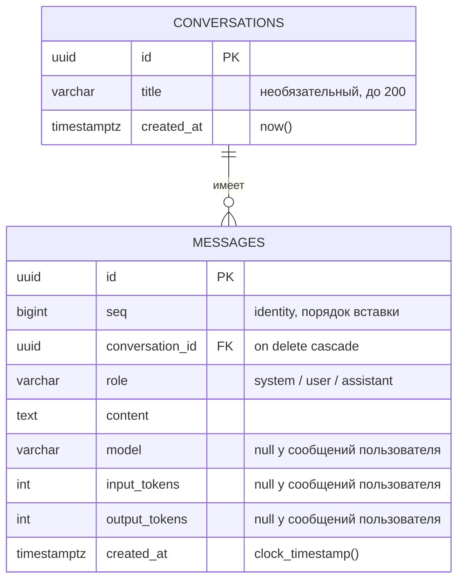

# База данных

Документ описывает схему, работу с ней из приложения, границы транзакций и проверенные на
практике наблюдения.

## Схема



Индексы: первичные ключи, `ix_messages_conversation_seq` по `(conversation_id, seq)`,
уникальность `seq`.

## Почему порядок сообщений — по `seq`, а не по времени

Первая версия сортировала сообщения по `created_at`, а при равенстве — по `id`. Интеграционный
тест на настоящей базе показал, что порядок иногда обратный.

Причина: `now()` в PostgreSQL возвращает **время начала транзакции**. Вопрос и ответ пишутся в
одной транзакции, поэтому `created_at` у них совпадает до микросекунды, а `id` — случайный UUID
и никакого порядка не задаёт.

Решение: колонка `seq` типа `bigint` с `GENERATED BY DEFAULT AS IDENTITY` — её нумерует сама
база в порядке вставки. Сортировка и индекс переведены на неё. Дополнительно `created_at` у
сообщений заполняется `clock_timestamp()` — настоящими часами на момент вставки.

Подменённая сессия такую ошибку показать не могла: в памяти порядок вставки сохраняется сам
собой. Это и есть ответ на вопрос, зачем коду работы с базой нужны не только моки.

## Границы транзакций

```mermaid
flowchart TD
    check["Проверка диалога<br/>SELECT, затем ROLLBACK"]
    call["Вызов модели<br/>транзакции нет"]
    write["Одна транзакция:<br/>диалог + вопрос + ответ"]
    fail["Ошибка → ROLLBACK"]

    check --> call --> write
    write -->|сбой| fail
```

Три решения и их причины:

- **Существование диалога проверяется до вызова модели** — неверный идентификатор не должен
  стоить генерации. Сразу после проверки транзакция закрывается.
- **Пока модель отвечает, открытой транзакции нет.** Вызов может длиться минуты вместе с
  повторами. Открытая транзакция всё это время держала бы соединение из пула и мешала
  автоочистке таблиц.
- **Диалог и оба сообщения пишутся одной транзакцией.** Половина обмена хуже, чем ничего: ответ
  без вопроса или вопрос без ответа и без ошибки невозможно истолковать позже. Диалог создаётся
  только вместе с успешным обменом, поэтому пустых диалогов после сбоев не остаётся.
- **При любом сбое — явный откат.** Без него неудавшаяся транзакция остаётся открытой, и все
  последующие запросы на этом соединении тоже падают.

Проверено намеренным сбоем между двумя вставками: счётчики диалогов и сообщений не изменились.

## Движок, пул и сессии

| Объект | Время жизни | Зачем |
|---|---|---|
| `AsyncEngine` | один на процесс, создаётся в lifespan | владеет пулом соединений |
| `async_sessionmaker` | один на процесс | фабрика сессий |
| `AsyncSession` | одна на запрос, через `Depends(get_session)` | границы транзакции запроса |

Пул нужен, потому что открытие TCP-соединения к базе дороже, чем переиспользование открытого.
Одна общая сессия на всё приложение недопустима: она смешала бы несвязанные запросы в одной
транзакции и не безопасна при одновременном использовании из разных задач.

## Миграции

Схему меняют только миграции Alembic. `create_all` не годится для продакшена: он умеет лишь
создать отсутствующие таблицы, не ведёт историю изменений, не переносит данные и не умеет
откатываться.

```bash
alembic upgrade head        # применить все миграции
alembic downgrade -1        # откатить последнюю
alembic revision --autogenerate -m "описание"
alembic current
```

Особенности настройки:

- Строка подключения берётся из настроек приложения, но переданный извне URL имеет приоритет —
  это нужно тестам (отдельная база) и CI.
- Включены `compare_type` и `compare_server_default`, иначе смена типа колонки или nullable не
  попадёт в автогенерацию.
- Автогенерация — черновик, а не готовый результат. В миграции со `seq` она не заметила смену
  значения по умолчанию у `created_at` и оставила безымянное ограничение уникальности, из-за
  которого `downgrade` не работал бы. Оба места дописаны руками.

## Индексы: замер на объёме

Запрос `where conversation_id = ? order by seq limit 50` на таблице из 40 000 сообщений:

| Вариант | План | Прочитано строк |
|---|---|---|
| С индексом `(conversation_id, seq)` | Index Scan | 51 |
| Без индекса | Seq Scan + сортировка top-N | 40 000 |

Стоимость по оценке планировщика: 6.6 против 1581.

На шести строках разницы нет — планировщик выбирает полный просмотр, потому что он дешевле
чтения индекса. Индексы имеют смысл на объёме, и проверять их надо на объёме.

## Тесты

| Файл | Уровень | Что подменено |
|---|---|---|
| `test_chat.py`, `test_conversations.py` | контракт API | сессия и провайдер |
| `test_db_integration.py` | интеграционный | ничего, настоящая PostgreSQL |

Интеграционные тесты помечены маркером `integration`. Тестовая база создаётся автоматически
рядом с рабочей, строится теми же миграциями и очищается перед каждым тестом через
`TRUNCATE ... CASCADE`. Если PostgreSQL не запущена, эти тесты пропускаются — обычный прогон
остаётся зелёным без Docker.

```bash
pytest                      # всё; интеграционные пропустятся без базы
pytest -m integration       # только тесты базы
pytest -m "not integration" # без базы
```

## Известные ограничения

- История, присланная клиентом, не сверяется с сохранённой: в базу попадает только новый обмен.
- Параметры генерации (`temperature`, `max_tokens`) не сохраняются.
- Нет постраничной выдачи истории: `GET /v1/conversations/{id}/messages` возвращает всё.
- Нет владельца диалога: любой клиент может прочитать любой диалог по идентификатору.
  Авторизация появится на неделе 5.
- Расход токенов лежит в строке сообщения; отдельная таблица учёта появится на неделе 4.
